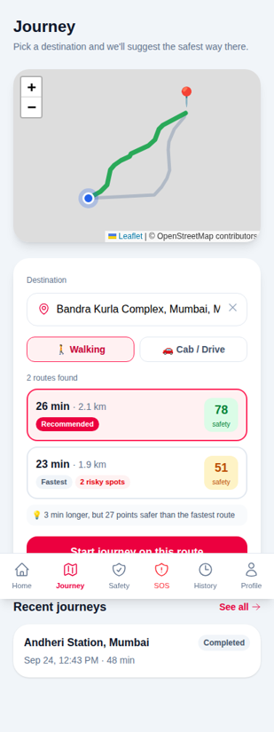
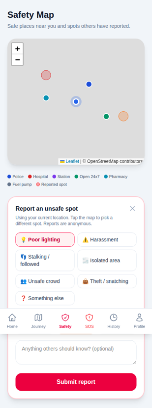
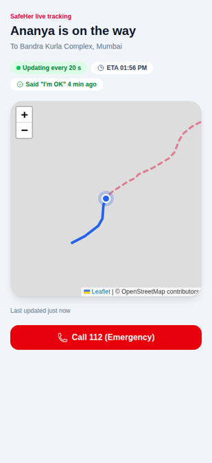
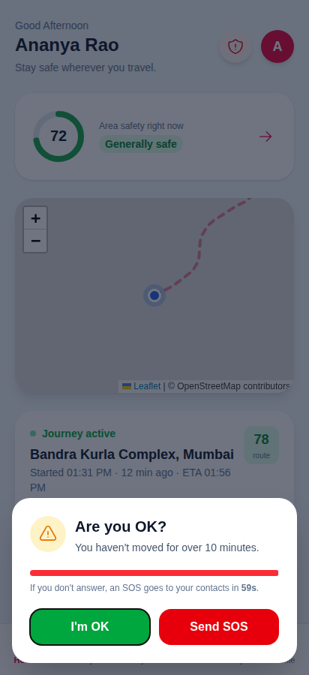
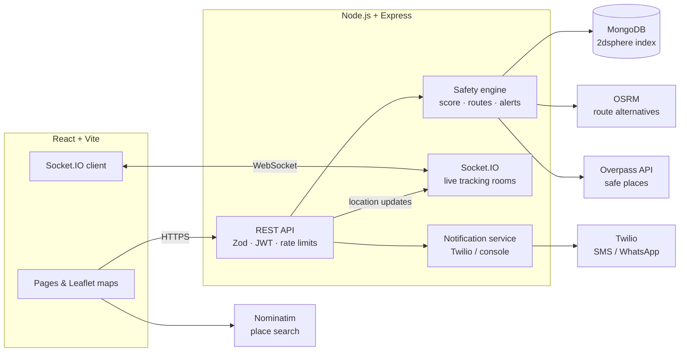

# SafeHer 🛡️

**A women-safety web app that recommends the safest route home, shares a live tracking link with trusted contacts, and raises an SOS automatically if something seems wrong.**

Built with React, Node.js/Express, MongoDB and Socket.IO, using free OpenStreetMap services for maps, places and routing.

| Safe route suggestions | Safety map & reports | Live tracking link | "Are you OK?" check |
|---|---|---|---|
|  |  |  |  |

---

## Features

### 🚨 Emergency
- **One-tap SOS** sends your location (and live tracking link) to all trusted contacts by SMS/WhatsApp via Twilio.
- **Free backup channel:** after an SOS the app opens WhatsApp or the SMS app *on your own phone* with the message pre-written, so alerts work even without a paid SMS provider.
- **"I'm safe now"** resolves the alert and notifies contacts.
- Emergency helplines (112, 1091, 100, 108) one tap away.

### 🧭 Safety recommendations
- **Safe route suggestions:** fetches 2–3 alternative routes (walking or driving), scores every ~150 m of each route, and recommends the safest, explaining the trade-off (*"3 min longer, but 27 points safer"*).
- **Area safety score (0–100)** for where you are, with the reasons behind it.
- **Nearby safe places:** police stations, hospitals, transit stations, pharmacies and 24x7 shops with call and directions buttons.
- **Community reports:** anonymously flag poor lighting, harassment, stalking, isolated areas and more. Reports feed back into scores and routes.

### 📍 Journeys
- **Live tracking link** anyone can open without an account, with real-time updates over WebSockets (falls back to polling).
- **Smart alerts** during a journey:
  - *Off route:* more than 250 m away from the chosen route
  - *Stopped:* no movement for 10+ minutes
  - *Overdue:* well past the expected arrival time
  - *Unsafe area:* entering a low-score area
- **"Are you OK?" check with a 60-second countdown.** If there's no answer, an SOS is sent automatically.
- Arrival detection, journey history and SOS history.

### 🔒 Engineering
- Request validation with **Zod**, central error handling, **Helmet** security headers, **rate limiting** on login, SOS and public endpoints.
- JWT authentication, bcrypt password hashing, owner-only access checks everywhere.
- **Privacy:** reports are anonymous, other users' SOS locations are never exposed, and tracking links stop showing location 2 hours after a trip ends.
- **37 automated tests** (Node test runner + Supertest), **GitHub Actions CI**, **Docker Compose** setup.
- Location updates are throttled by distance and time to avoid flooding the database.

---

## How the safety score works

The score is a transparent formula rather than a black-box model, so every number can be explained to the user.

```
score = 80 − 9 × risk + safePlacesBonus − nightPenalty        (clamped to 0–100)

risk            = Σ over reports & SOS alerts within 300 m of:
                    severity (1–3) × recency × closeness
                  recency   = 0.5 ^ (ageInDays / 30)       (ignored after 180 days)
                  closeness = 0.3 + 0.7 × (1 − distance / 300 m)
                  × 1.3 at night (8 pm – 6 am)
safePlacesBonus = Σ weight × (1 − distance / 400 m), max +15
                  police 7 · hospital 5 · station 4 · 24x7 shop 4 · pharmacy 2 · fuel 2
nightPenalty    = 10 at night
```

**Route score** = 70% average + 30% worst sample along the route, so one very unsafe stretch isn't hidden by a good average. The safest route is recommended unless it's less than 5 points safer than the fastest one.

Code: [`server/services/safety.service.js`](server/services/safety.service.js) · Tests: [`server/tests/safety.test.js`](server/tests/safety.test.js)

---

## Architecture



---

## Getting started

**Requirements:** Node.js 20+, and MongoDB (local or a free [Atlas](https://www.mongodb.com/atlas) cluster).

```bash
git clone https://github.com/vipinswarnkar/Safeher.git
cd Safeher

# Backend
cd server
cp .env.example .env        # add your MONGODB_URL and JWT_SECRET
npm install
npm run dev                 # http://localhost:5000

# Frontend (new terminal)
cd client
cp .env.example .env
npm install
npm run dev                 # http://localhost:5173
```

### Or with Docker

```bash
docker compose up --build
# App: http://localhost:8080 · API: http://localhost:5000/api/health
```

### Environment variables (`server/.env`)

| Variable | Required | Description |
|---|---|---|
| `MONGODB_URL` | ✅ | MongoDB connection string |
| `JWT_SECRET` | ✅ | Long random string for signing login tokens |
| `PORT` | | API port (default `5000`) |
| `CLIENT_URL` | | Allowed frontend origin(s), comma separated (default `http://localhost:5173`) |
| `PUBLIC_APP_URL` | | Base URL used in tracking links (defaults to the first `CLIENT_URL`) |
| `TWILIO_ACCOUNT_SID`, `TWILIO_AUTH_TOKEN` | | Enable real SMS/WhatsApp alerts (otherwise printed to the console) |
| `TWILIO_SMS_FROM`, `TWILIO_WHATSAPP_FROM`, `SOS_CHANNELS` | | Sender numbers and channels (`sms`, `whatsapp`) |
| `OSRM_FOOT_URL`, `OSRM_DRIVING_URL`, `OVERPASS_URL` | | Point to your own map servers in production |
| `SAFETY_TIMEZONE` | | Time zone for night-time scoring (default `Asia/Kolkata`) |

`client/.env`: `VITE_API_URL` (default `http://localhost:5000/api`).

> Location access in the browser needs **HTTPS** or `localhost`. To try it on your phone, deploy it (below) or use a tunnel such as `ngrok`.

### Tests

```bash
cd server && npm test       # 37 unit + API tests
cd client && npm run lint
```

---

## API overview

All routes are under `/api`. 🔒 = requires `Authorization: Bearer <token>`.

| Method | Route | Description |
|---|---|---|
| POST | `/auth/register`, `/auth/login` | Create account / get token |
| GET | `/auth/me` 🔒 | Current user |
| GET, PUT | `/user/profile` 🔒 | View / edit profile |
| PUT | `/user/change-password` 🔒 | Change password |
| GET, POST, PUT, DELETE | `/contacts` 🔒 | Trusted contacts |
| POST | `/journey/start` 🔒 | Start a journey (optional planned route and ETA) |
| GET | `/journey/active`, `/journey/history` 🔒 | Journeys |
| PATCH | `/journey/end/:id` 🔒 | End a journey |
| POST | `/journey/:id/check-in` 🔒 | "I'm OK" reply to a smart alert |
| POST | `/location/update` 🔒 | Save location, push to trackers, run smart alerts |
| POST | `/sos/trigger` 🔒 | Send SOS |
| GET | `/sos/history` 🔒 | Past alerts |
| PATCH | `/sos/resolve/:id` 🔒 | Mark safe (notifies contacts) |
| GET | `/safety/score?lat&lng` 🔒 | Area safety score with reasons |
| GET | `/safety/places?lat&lng&radius` 🔒 | Nearby safe places |
| GET | `/safety/routes?fromLat&fromLng&toLat&toLng&mode` 🔒 | Scored route alternatives + recommendation |
| POST | `/reports` 🔒 | Report an unsafe spot |
| GET | `/reports/nearby?lat&lng&radius`, `/reports/mine` 🔒 | Reports |
| DELETE | `/reports/:id` 🔒 | Delete own report |
| GET | `/track/:token` | **Public** live-tracking data |
| GET | `/health` | Health check |

**Socket.IO:** emit `track:join` with a share token; receive `track:location`, `track:status` and `track:checkin`.

---

## Project structure

```
server/
  controllers/   request handlers
  services/      safety engine, smart alerts, places, routing, notifications
  models/        Mongoose schemas (User, Contact, Journey, Location, SOS, Report)
  middleware/    auth, validation, rate limits, errors
  validators/    Zod schemas
  tests/         node:test + supertest
  socket.js      live tracking rooms
client/src/
  pages/         Dashboard, Journey, Safety, SOS, History, Profile, Contacts, Track
  components/    SafeMap, RoutePlanner, SafetyScoreCard, SafetyCheckModal, ...
  hooks/         useApi, useSOS
```

## Deploying (free tiers)

- **Database:** MongoDB Atlas (M0)
- **API:** Render or Railway. Set the env vars above, plus `CLIENT_URL` = your frontend URL.
- **Frontend:** Vercel or Netlify. Set `VITE_API_URL` to `https://<your-api>/api`, and add a rewrite of all paths to `/index.html` so `/track/...` links work.

## Roadmap

- Registered SMS sender (DLT) for production delivery in India
- Installable app (PWA) with push notifications and offline SOS queue
- Shake-to-SOS and a fake incoming call
- Report moderation and upvotes ("I faced this too")

## Credits

Map data © [OpenStreetMap](https://www.openstreetmap.org/copyright) contributors · Routing by [OSRM](https://project-osrm.org/) · Places via [Overpass API](https://overpass-api.de/) · Search by [Nominatim](https://nominatim.org/)
